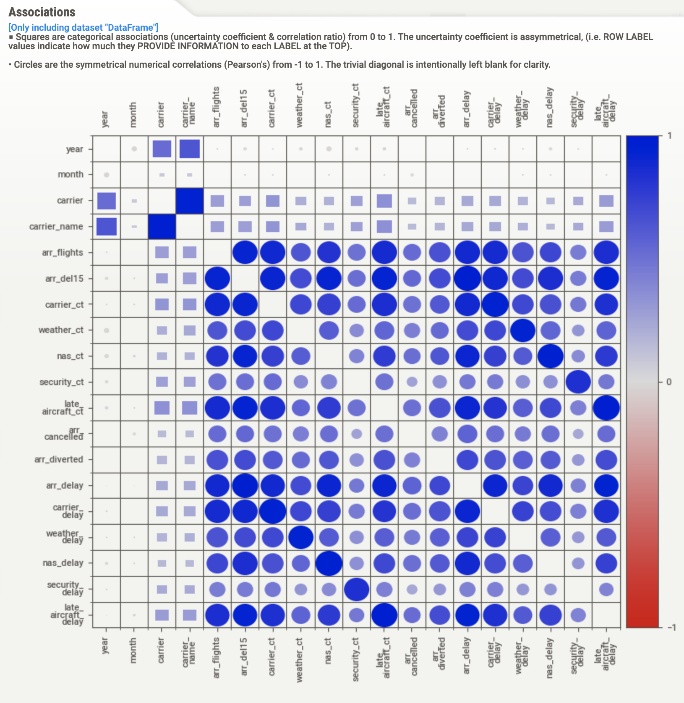

# Airlines dataset EDA

- [x] create priliminary dataset (2003-2022)
- [x] use a profiler for EDA
- [x] find Airports dataset (draft)
- [x] merge to create geographic viz
- [x] find column definition dictionary
- [x] identify problem statements (kind of done)
- [ ] create sqlite db with facts and dimension tables? 

# [Preliminary EDA Report](https://htmlpreview.github.io/?https://github.com/ayushsubedi/airlines_eda/blob/main/profiler_reports/eda_report_sweetviz.html)

# Data Definition
| **Column **         | **Description**                                                                                         |
|---------------------|---------------------------------------------------------------------------------------------------------|
| year                | Year data collected                                                                                     |
| month               | Numeric representation of the month                                                                     |
| carrier             | Carrier's IATA Code                                                                                     |
| carrier_name        | Carrier Name.                                                                                           |
| airport             | Airport code.                                                                                           |
| airport_name        | Name of airport.                                                                                        |
| arr_flights         | Number of flights arriving at airport                                                                   |
| arr_del15           | Number of flights more than 15 minutes late                                                             |
| carrier_ct          | Number of flights delayed due to air carrier. (e.g. no crew)                                            |
| weather_ct          | Number of flights due to weather.                                                                       |
| nas_ct              | Number of flights delayed due to National Aviation System (e.g. heavy air traffic).                     |
| security_ct         | Number of flights canceled due to a security breach.                                                    |
| late_aircraft_ct    | Number of flights delayed as a result of another flight on the same aircraft delayed                    |
| arr_cancelled       | Number of cancelled flights                                                                             |
| arr_diverted        | Number of flights that were diverted                                                                    |
| arr_delay           | Total time (minutes) of delayed flight.                                                                 |
| carrier_delay       | Total time (minutes) of delay due to air carrier                                                        |
| weather_delay       | Total time (minutes) of delay due to inclement weather.                                                 |
| nas_delay           | Total time (minutes) of delay due to National Aviation System.                                          |
| security_delay      | Total time (minutes) of delay as a result of a security issue .                                         |
| late_aircraft_delay | Total time (minutes) of delay flights as a result of a previous flight on the same airplane being late. |

# Corr viz




# Possible Problem Statements
> For some of the problem statements below, there is a need to find daily data, or use this data (limited to October 1987 to April 2008)

The problem statements are from https://community.amstat.org/jointscsg-section/dataexpo/dataexpo2009

- When is the best time of day/day of week/time of year to fly to minimise delays?
- Do older planes suffer more delays?
- How does the number of people flying between different locations change over time?
- How well does weather predict plane delays?
- Can you detect cascading failures as delays in one airport create delays in others? Are there critical links in the system?

# Installation

#### Clone the repo

```
git clone https://github.com/ayushsubedi/airlines_eda`
```

#### CD into the cloned directory and create a virtualenv

```
python -m venv env
```

### Enable virtualenv

```
source env/bin/activate
```

### Install dependency packages from requirements.txt

```
pip install -r requirements.txt
```

### Start notebook

```
jupyter-lab
```
